# Active Directory Home Lab

This is a hands-on Active Directory Home Lab designed to simulate a real life enterprise infrastructure.
This project/guide includes a domain controller, Organizational Structures, Users, Security Groups, Mapped Drives, GPO's, and so much more - mirroring real life modern IT environments.

The goal of this lab is to:
- Build practical skills in **Windows Server 2019**, **AD DS**, **GPOs**, & **file services**.
- Create portfolio-ready IT examples.
- Understand real-world administration workflows.

## Requirements
To build this Active Directory Home Lab, you will need:

### Virtualization Platform
Choose one of the following:
   - **VirtualBox** (free) -> https://www.virtualbox.org/wiki/Downloads
   - **VMware Workstation/Player**
   - **Hyper-V**

### Operating System ISOs
Download the installer images:
   - **Windows Server (2019 or 2022) ISO** -> https://www.microsoft.com/en-us/evalcenter/evaluate-windows-server-2019
   - **Windows 10/11 ISO** -> https://www.microsoft.com/en-us/software-download/windows11

### Hardware Recommendations
This are recommended to have:
   - **8–16 GB RAM recommended**
   - **50–100 GB free disk space**
   - **Quad-core CPU recommended**

### Networking Requirements
   - Internal network or NAT network (VBox/VMware/Hyper-V)

## Setting Up the Domain Controller (Windows Server 2019 / 2022 Install)

### 1. Create a New VM

When creating the VM:

- CPU: **2-4 vCPUs**
- RAM: **4-8 GB**
- Disk: **40-60 GB**
- Network Adapter: **Internal Network / Host-Only / LabNet**

### 2. Attach the Windows Server ISO

While attaching:

- Mount the **Windows Server 2019/2022** ISO
- Start the VM

### 3. Install Windows Server

While Installing:

- Choose **Windows Server 2019/2022 Standard (Desktop Experience)**
- Select **Custom Install**
- Install to the newly created virtual disk

### 4. Initial Configuration

After configuration completes:

- Create/Set a **strong** *local Administrator* password (i.e **OldPassword123!**)
- Open **Server Manager**
- Set the computer/system name (ex: SRV-DC01)
- Restart the VM

### 5. Configure Network Settings (Static Networking)

Setting up a static IP:

1. Open **Network & Internet Settings**
2. Change **adapter options** → Right-click **Ethernet** → **Properties**
3. IPv4 Settings: 
   - IP: 192.168.10.1
   - Subnet: 255.255.255.0
   - Gateway: BLANK
   - Preferred DNS: 192.168.10.1
   

## Installing AD DS Roles
After your server is renamed and assigned a static IP, you can begin installing the roles required for Active Directory Domain Services (AD DS)

### 1. Open Server Manager
Server Manager usually opens automatically on login, but you can also launch it from the start menu

### 2. Add Roles & Features
Click **Manage** → **Add Roles and Features**.

### 3. Choose Installation Type 

Steps:

   - Select **Role-based or feature-based installation**

   
   - Click **Next**

### 4. Select Your Server

Steps:

   - Choose your server from the list (ex. SRV-DC01.lab.local)

   

   - Click **Next**

### 5. Select Server Roles & Features

Server Roles & Features:
 

   - **Active Directory Domain Services**
   - **DNS Server**
   - **DHCP Server** *(optional but recommended for labs)*
   - **File and Storage Services**
   - **Remote Server Administration Tools**
   - **Windows Defender Antivirus**
   - **Windows PowerShell**
   - **Windows Server Backup** *(optional)*

If prompted, click **Add features** for any dependency warnings

Click **Next**.

### 6. Confirm & Install
   - Review the summary
   - Click **Install**
   - Allow installation to complete

## Promoting the Server to Domain Controller

### 1. Launch Promotion Wizard
In Server Manager after installing AD DS, click the yellow notification flag, then select:
   - Promote this server to a domain controller.

### 2. Create a New Forest

Choose:

- **Add a new forest**
- Enter a Domain Name: (ex: **lab.local**)
- NetBIOS name will auto-fill(ex: **LAB**)

Click **Next**.

### 3. Domain Controller Options
Configure the following:

Checklist:

- **Forest Functional Level**: **default**
- **Domain Functional Level**: **default**
- **Domain Controller Capabilities:**
   - DNS Server **checked**
   - Global Catalog **checked**
   - RODC (Read-Only Domain Controller) **unchecked**
- Set a **DSRM** (Directory Services Restore Mode) password

Click **Next.**

### 4. DNS & Additional Options

Notes:

- If a **DNS delegation warning** appears -> this is normal -> Click next
- Accept all default paths for **Databae, SYSVOL, & Log files**

Continue until the **Review Options** page 

### 5. Complete Installation

Final Steps:

- Review **all** settings 
- Let the **prerequisite check** complete 
- Click **Install**
- The server will automatically reboot
- The server will now reboot as a **Domain Controller** in a brand new forest

## Creating Users, Security Groups, & Organizational Units (OUs)
This section covers the core structure of the Active Directory environment. You & I will be able to create organizational units, security groups, and user accounts that reflect a real-world enterprise environment.

### 1. Open AD Users and Computers (ADUC)

Steps:

- Click **Start**
- Search for **Windows Administrative Tools**
- Click **Active Directory Users and Computers**

### 2. Create Organizational Units

Suggested OUs & Layout:

- CorpUsers
   - Sales
   - HR
   - IT
   - HelpDesk
- Workstations
   - Sales
   - HR
   - IT
   - HelpDesk
- Groups
- Admins 
- Service Accounts 

How to Create an OU:

- Open **Active Directory Users & Computers** again
- Right click your domain (ex. **lab.local**)
- Select **New** -> **Organizational Unit**

- Enter the **OU** name (ex. **Sales**)

- Click **OK**

### 3. Create Security Groups
Security groups define permissions for shared folders, mapped drives, & GPO targeting.

 Recommended Global Security Groups:
 

- **SalesUsers** 
- **HRUsers**
- **ITUsers**
- **HelpDesk** (Limited Admin) 
- **IT_Admins** (Administrative)

To create a security group:

   - Right-click the **Groups** OU
   - Select **New** -> **Group**
   - Configure:
      - Group Name: **SalesUsers**
      - Group Scope: **Global**
      - Group Type: **Security**
   - Click **OK**

Repeat for each department wanted

### 4. Create User Accounts
Create real user accounts inside the corresponding departmental OU.

Steps:

- In **Active Directory Users & Computers**, navigate to the your desired OU:
   - CorpUsers -> Sales (or HR, IT, etc)
- Right-click the **OU** -> **New** -> **User**

- Fill in: 
   - First name (ex. **Alexander**)
   - Last name (ex. **Smith**)
   - User logon Name (ex: **salesrep01**)

- Set an **initial password** → **optionally** uncheck “User must change password at next logon.”

- Click **Next**, then **Finish**

### 5. Add Users to Security Groups 

After creating a user:

- Right-click the user -> **Properties**
- Go to the **Member of** tab
- Click **Add**
- Enter the **correct department group** (ex. **SalesUsers, HRUsers, ITUsers**)
- Click **OK**

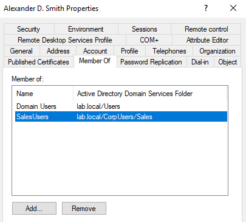

Now the user will inherit:
   - NTFS folder permissions
   - Share Access
   - GPO targeting (mapped drives, restrictions, etc)

### 6. Creating Administrative Accounts
Create dedicated admin identities with least privilege.
Never use built-in Administrator account for daily work.

Steps:

- Open **Active Directory Users and Computers** (ADUC) 

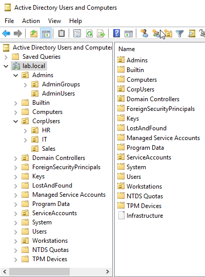

- Navigate to the **Admins** -> **AdminUsers OU** (create if not done so already)

- Right-click the **OU** -> **New** -> **User**

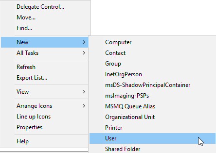

- Fill in the account information:
   - First Name: (ex. Janet)
   - Last Name: (ex. Finnel)
   - User Logon Name: (ex. jdoe.admin)

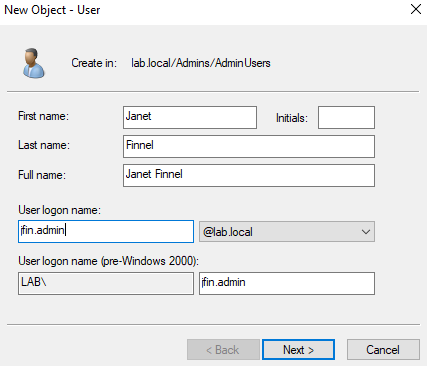

- Click **Next**
- Set a **strong password**:
   - Enable options as needed

- Click **Next**, then **finish** to create the account
- Add the new account to the **IT_Admins security group**:
   - **Right-click** the user -> **Properties** -> **Member of** tab -> **Add** -> Enter **IT_Admins** -> **Check Names** -> **Ok**

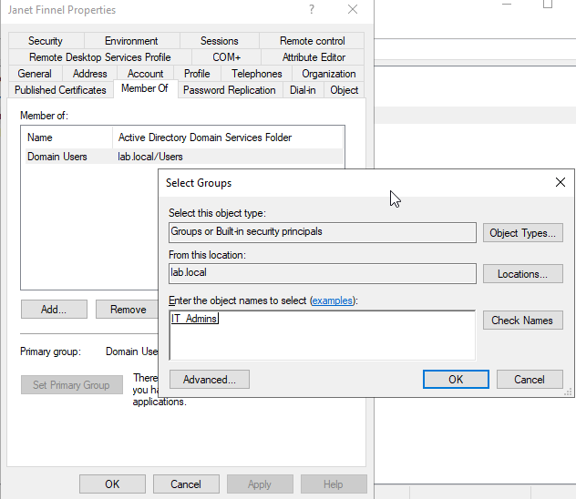

## Creating Departmental Shared Folders
Provides shared access of files for departments with proper permissions.

Steps:

- Log into your server
- Click the search bar, open file explorer & navigate to your desired location for your shared folders (e.g **C:\DeptShares**)
- Create folders for each department you'd like:
   - **Sales**
   - **HelpDesk**
   - **IT**

- Right-click each folder -> Click **properties** -> **Sharing tab** -> **Advanced Sharing**

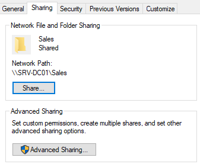

- Now check **share this folder**, set a **share name**, then click **permissions**.
- Add the corresponding **security group** for each folder & assign **permissions**:
   - Sales -> **SalesUsers** -> **Modify**
   - HelpDesk -> **HelpDesk** -> **Modify**
   - IT_Admins -> **IT_Admins** -> **Full Control**

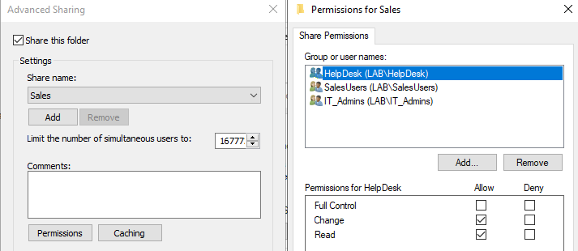

- Click **apply**, then **ok**
- Switch to **security tab** to make sure that the **NTFS permissions** match the **share permissions**

- Test access by using another **VM** as a user from each **group**

## Creating Group Policies (GPOs)
The purpose of GPO's is to enforce **policies** & automate various **configurations** for users & their computers

Steps:

- Open **Group Policy Management Console** (GPMC):
   - **Start** -> **Administrative Tools** -> **Group Policy Management**

- Right click your domain (**lab.local**) -> **Create a GPO in this domain, & link it here..**

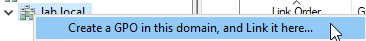

- Give your new **GPO** a **descriptive name** (ex. **Password Policy GPO**)

- Right-click the **GPO** -> edit to open the **Group Policy Management Editor**

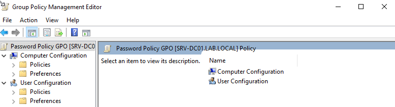

- Configure policies based on a specific purpose, below are some examples:

---

   - **Password Policy:** **Computer Configuration** -> **Policies** -> **Windows Settings** -> **Security Settings** -> **Account Policies** -> **Password Policy**
      - Policies enabled in this instance: **Password must meet complexity requirements** & **Minimum password length**

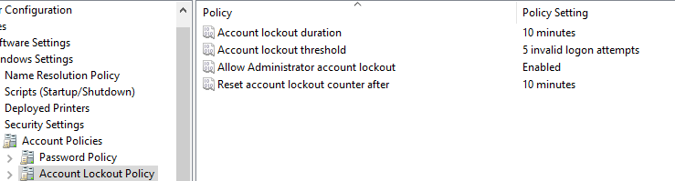

---

   - **Desktop Restrictions:** **User Configuration** -> **Policies** -> **Adminstrative Templates** -> **Desktop**
      - Policies enabled in this instance: **Hide & Disable all items on the desktop, Remove My Documents icon on Desktop, Hide Network Locations, Remove Properties from the Computer Icon, & Remove recycle bin icon from desktop**

---

   - **Control Panel Restrictions:** **User Config** -> **Admin Templates** -> **Control Panel** -> **Prohibit access to Control Panel**

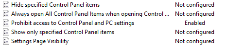

---

   - **Drive Mapping:**
      
   - Create Department folders
      - Inside `C:\DeptShares`, create:
         - **Sales**
         - **HR**
         - **IT**
         - **HelpDesk**

---

   - Configure **NTFS Permissions**
   Each department folder gets modify rights for respective department group & full control for administrators
      - Ex. for Sales:
         - Right click **Sales** -> **Properties** -> **Security** -> **Advanced**
         - Click **Disable Inheritance** -> Convert **inherited permissions**
         
         

         - Remove all unnecessary principals to your liking 
         - Add the following:
            - Domain Admins -> **Full Control**
            - SalesUsers -> **Modify**
         - WARNING: 
            - Don't use individual user accounts
            - Don't give full control to non-admins
   - Share the folder
      - Right click **sales folder** -> **Properties** -> **Sharing** -> **Advanced Sharing**
         - Check **Share this folder**
         - Share name: **Sales**

         

         - Click **Permissions** -> Remove everyone 
         - Add:
            - SalesUsers -> **Read/Write**
            - Domain Admins -> **Full Control**

         
         
         - Close editor when finished

---

   - Enable **Access-Based Enumeration (ABE)**
   This hides folders users do not have NTFS permissions to.
      - Open Server Manager
      - Go to:
         - **File & Storage Services -> Shares**
      - **Right-click your share -> Properties**
      - Under settings, check:
         - **Enable access-based enumeration**

         

      Now HR users cannot even see the Sales folder, & vice versa

---

   - Create Mapped Drive GPO
   Path: Group Policy Management -> CorpUsers -> Department OU
      - Right-click the OU -> Create a GPO in this domain & link it here...
   Name ex. Sales - Mapped Drive

   Edit the GPO:
      - User Config -> Pref -> Windows Settings -> Drive Maps 
      - Right-click -> New -> Mapped Drive 
   
---

   - Configure the Drive Mapping 
      - Action: **Create**
      - Location:
      - Label as: Sales **Share**
      - Drive Letter: **S:**
      - Reconnect: **Y**

      

   - Common Tab -> Item-Level Targeting
      - Check **Item-level targeting**
      - Click **Targeting...**
      - **New Item** -> **Sec Group**
      - Group: **SalesUsers**
      - Match: **User in group**

      

---

   - Security Filtering 
   For each department GPO:
      - Keep:
         - **Authenticated Users**
         - **SalesUser** (or HRUsers, ITUsers, etc)
      - Do not Keep / Add:
         - Computers
         - Domain Admins
         - IT Admins
         - Everyone 

---

   - Apply GPO on the Client Machine
   On the Client's workstation:
      - `gpupdate /force`
   Then log out & back in
   Mapped drives only appear at user logon

---

   - Test the Configuration
   Test UNC Path:
      - `\\SRV-DC01\Sales` on search bar
      or 
      - `start \\SRV-DC01\HR` on CMD
      If the folder appears:
         - UNC path is working
         - **Share** + **NTFS** is correct
      - Mapped drive should now work
   
   - Check applied GPOs:
      - `gpresult /r`
      Under User Settings, you should encounter:
         - Sales - Mapped Drives
      - Check Drive Mapping:
         - Open **This PC** & **verify**

## Troubleshooting Guide
Below may be some common issues you may encounter in a basic AD Home Lab & how to resolve them.

### Mapped Drives Not Appearing

Symptoms

   - Drive letter does not show in *This PC*
   - `gpresult /r` does not list the GPO 
   - **UNC path**works but drive mapping does not

Fixes

- Ensure the following doesn't conflict with your mapped drives
      - **Control Panel Restrictions**
      - **Desktop Restrictions**
      - Any **GPO**
   - Verify Security Filtering includes:
      - **Authenticated Users**
      - Correct department group (**HRUsers, SalesUsers**, etc)
   - Ensure correct **Item-Level Targeting**:
      - **User is in group** (not "**primary group**")
   - Always remember to run: `gpupdate /force`
      - log out, & log back in again

### The network name cannot be found

Symptoms

- `\\SRV-DC01\Share` fails
- `start \\Server\Share` returns error

Fixes

- Test hostname resolution:
   - `ping SRV-DC01`
   - `nslookup SRV-DC01`

- If hostname fails but IP works:
   - Check DNS client settings (must point to DC)
   - Ensure DC's DNS service is running

- Test UNC directly:
   - start `\\192.168.10.10\HR`

### GPO Not Applying

Fixes

- Verify the **GPO** is linked to the correct **OU**
- Ensure the **user/computer** is inside the **OU**
- Check inheritance:
   - `gpresult /h report.html`
- Remove extra filters (like computers, admins, etc)

## Network Topology

Network Diagram

### Legend

What means what?

- **SRV-DC01** — Windows Server 2019 Domain Controller  
  - Hosts: AD DS, DNS, DHCP (optional), File Shares, GPOs  
  - IP: **192.168.10.1**

- **HRWS01** — HR department workstation  
  - IP: **192.168.10.2**

- **ITWS01** — IT department workstation  
  - IP: **192.168.10.3**

- **SLSWS01** — Sales department workstation  
  - IP: **192.168.10.4**

- **Internal Network**  
  - Subnet: **192.168.10.0/24**

- **UNC Path Examples**
  - `\\SRV-DC01\HR`
  - `\\SRV-DC01\IT`
  - `\\SRV-DC01\Sales`

- **Drive Mapping**
  - H: → HR Share  
  - I: → IT Share  
  - S: → Sales Share  

## What I Learned 
Working through this whole lab, it taught me several core IT concepts that directly apply to real life enterprise environments:

Active Directory Fundamentals

- How domains, OUs, users, computers, and security groups function together  
- Why organizations use **role-based access control (RBAC)** rather than per-user permissions  
- The importance of separating **admin** and **standard** accounts  

Group Policy (GPO)

- How to create, link, and scope GPOs to specific OUs  
- The difference between:
  - **Policies** (enforce configurations)
  - **Preferences** (apply settings like mapped drives)  
- How **Security Filtering** + **Item-Level Targeting** determine who receives a GPO  

File Sharing & Permissions

- How to configure **NTFS permissions** vs. **Share permissions**  
- Why Access-Based Enumeration hides folders users cannot access  
- How UNC paths work: `\\SRV-DC01\ShareName`  

Networking & DNS

- Setting static IPs for domain environments  
- Why Windows clients *must* use the Domain Controller as DNS  
- Troubleshooting share access with:
  - `ping`
  - `nslookup`
  - `net view`
  - `start \\Server\Share`  

Troubleshooting Skills

- Fixing workstation trust issues  
- Rejoining computers to the domain  
- Diagnosing GPO problems using:
  - `gpupdate /force`
  - `gpresult /r`
  - Event Viewer  

Overall, I learned how Windows enterprise environments are structured, how permissions flow, and how to diagnose issues across layers like a real Help Desk or SysAdmin technician could.

*Created by [B. Fontaine]*

