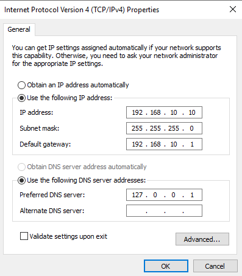

# Active Directory Home Lab


This guide will walk you through setting up a complete, albeit basic, Active Directory (AD) environment for IT practice project building.

---

## Goal
<details>
<summary>Build a functional AD lab on a home machine using:</summary>

- **Windows Server 2019 (Domain Controller)**
- **Windows 10/11 Client VM**
- **pfSense or NAT networking (optional)**
- **Users, OUs, GPOs, and basic administration tasks**
</details>

---

## Requirements
- Virtualization: VirtualBox, VMware, or Hyper-V https://www.virtualbox.org/wiki/Downloads
- Windows Server ISO (2019 or 2022) https://www.microsoft.com/en-us/evalcenter/evaluate-windows-server-2019
- Windows 10/11 ISO https://www.microsoft.com/en-us/software-download/windows11
- 8–16 GB RAM recommended
- 50–100 GB free disk space

---

## Setting Up the Domain Controller (Windows Server 2019 / 2022 Install)

### 1. Create a New VM
<details>
<summary>When creating the VM:</summary>

- Allocate **2–4 vCPUs**
- Assign **4–8 GB RAM**
- Create a **40–60 GB virtual disk**
</details>

### 2. Attach the Windows Server ISO

### 3. Install Windows Server
<details>
<summary>While Installing:</summary>

- Choose **Windows Server 2019/2022 Standard (Desktop Experience)**
- Select **Custom Install**
- Install to the virtual disk
</details>

### 4. Initial Configuration
<details>
<summary>After install completes:</summary>

- Create a **strong** local Administrator password (i.e **OldPassword123!**)
- Open **Server Manager**
- Set the computer name (ex: SRV-DC01)
- Restart the VM


</details>

### 5. Configure Network Settings
<details>
<summary>Setting up a static IP:</summary>

1. Open Network & Internet Settings
2. Change **adapter options** → Right-click **Ethernet** → **Properties**
3. IPv4 Settings: 
   - IP: 192.168.10.10 (example)
   - Subnet: 255.255.255.0
   - Gateway: 192.168.10.1 (example)
   - Preferred DNS: 127.0.0.1 (loopback) 
   

</details>

---

## Installing AD DS Roles

### 1. Open Server Manager
Click **Manage** → **Add Roles and Features**.

### 2. Choose Role-Based Installation
Click Next until you reach **Server Roles**.

### 3. Install Active Directory Domain Services & Features
<details>
<summary>Checklist:</summary>

- Active Directory Domain Services
- DHCP Server
- DNS Server
- File & Storage Services 
- Remote Server Administrator Tools 
- Windows Defender Anitvirus 
- Windows Powershell 
- Window Server Backup

Click Install. (You can mix & match what you would like to add)
</details>

---

## Promoting the Server to Domain Controller

### 1. After Installation
In Server Manager, click the yellow notification flag → Promote this server to a domain controller.

### 2. Create a New Forest
<details>
<summary>When Creating:</summary>

- Choose **Add a new forest**
- Enter your Domain name. Example: (**lab.local**)
- NetBIOS name auto-fills the name (e.g **LAB**)

Click **Next.**

</details>

### 3. Domain Controller Options
<details>
<summary>Checklist:</summary>

- Leave **Forest Functional Level** at **default**
- Leave **Domain Functional Level** at **default**
- Ensure **DNS server** is **checked**
- **Global Catalog** should be **checked**
- Leave **RODC** (Read-Only Domain Controller) **unchecked**
- Set a **DSRM** (Directory Services Restore Mode) password

Click **Next.**

</details>

### 4. DNS & Additional Options
- A DNS delegation **warning** may appear - this is normal, you may **skip**
- Click **next** through additional options and paths pages

### 5. Complete Setup
- Review **all** settings 
- Let the prerequisite check complete 
- Click **Install**

The server will reboot as a **Domain Controller**.

---

## Creating Users, Security Groups, & Organizational Units (OUs)

### 1. Open AD Users and Computers (ADUC)
<details>
<summary>Steps:</summary>

- Start by clicking the search bar
- Type **Windows Administrative Tools**
- Click **Active Directory Users and Computers**

</details>

### 2. Create Security Groups
<details>
<summary>Recommended Security Groups:</summary> 

Create desired groups to organize **permissions and role-based access** in your domain 

- **Sales_Users** - **Standard** Users in Sales dapartment 
- **HelpDesk_Techs** - Help desk staff with **limited** admin privileges to resolve issues
- **IT_Admins** - **Full** administrative rights for IT staff

</details>

<details>
<summary>How to Create a Security Group</summary>

- Open **Active Directory Users and Computers**
- Navigate to the OU where you would like to store your groups (e.g **CorpUsers** -> **IT** or another dedicated Group OU)
- Right click the **OU** -> **New** -> **Group**
- Configure the following:
   - Group Name: (ex. **IT_Admins**) 
   - Group Scope: **Global**
   - Group Type: **Security**
- Click **Ok** to create the group.

You can now add users to these groups to create accounts, in this instance, for the IT department

</details>

### 3. Create Organizational Units
**Right‑click** domain → **New**→ **Organizational Unit**.
<details>
<summary>Suggested OUs:</summary>

- Users
- Admins
- Computers
- Groups
- CorpUsers
- Workstations
- Service Accounts

</details>

<details>
<summary>How to Create an OU</summary>

- Open **Active Directory Users & Computers**
- Right click your domain (ex. **lab.local**)
- Select **New** -> Organizational Unit
- Enter the OU name (ex. **Sales**)
- Click **OK**

Repeat for each department you would want to organize

</details>

### 4. Create User Accounts
Create users inside the correct department OU for clear and more efficient management
<details>
<summary>Creating a User</summary>

- In **Active Directory Users & Computers**, navigate to the your desired OU. (Ex. lab.local -> **Sales**)
- Right-click the OU -> New -> User
- Fill in: 
   - First name (ex. Alexander)
   - Last name (ex. Smith)
   - User logon Name (ex: **salesrep01**)
- Set an initial password → **optionally** uncheck “User must change password at next logon.”
- Click **Next**, then **Finish**

</details>

### 5. Adding Users to Security Groups 
After creating a user, add them to the appropriate group by:
<details>
<summary>Steps:</summary>

- Right-click the user -> Properties
- Go to the Member of tab
- Click Add
- Enter the group name (ex. Sales_Users, HelpDesk_Techs, IT_Admins)
- Click OK

Users now will inherit permissions based on the groups assigned to them.

</details>


### 6. Add Admin Users
Create an account such as helpdesk.admin.
Add them to:
- Domain Admins **or**
- IT Support (recommended, safer)

---

## 📘 Joining a Windows Client to the Domain

### 1. Configure Client Network
Set DNS to the domain controller’s IP:
- Preferred DNS: 192.168.1.10

### 2. Join the Domain
1. Right‑click This PC → Properties
2. Rename this PC (advanced)
3. Change…
4. Select Domain and enter: home.lab
5. Enter domain admin credentials
6. Restart PC

### 3. Log In with Domain User
On login screen:
- Click “Other user”
- Login using: HOME/jdoe

---

## 📘 Group Policies (GPOs)

### 1. Open Group Policy Management
Server → Start → Group Policy Management.

### 2. Create a New GPO
Right‑click domain → Create a GPO.
Examples:
- Password Policy
- Desktop Restrictions
- Disable Control Panel
- Map Network Drives

### 3. Edit GPO
Right‑click GPO → Edit.
Common paths:
- Computer Configuration → Policies → Windows Settings → Security Settings → Account Policies
- User Configuration → Policies → Administrative Templates

### 4. Apply GPO to OUs
Drag GPO onto target OU.

### 5. Force Update on Client
```cmd
gpupdate /force


